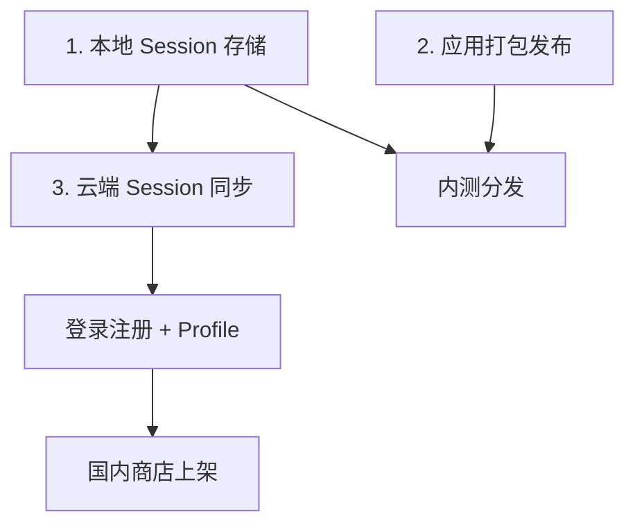

# DeepSeek Chat RN — 待办总览

> 规划说明索引，详细方案见各子文档。  
> 更新时间：2026-07-05

---

## 文档索引

| 文档 | 内容 |
|------|------|
| [chat-session-storage.md](./chat-session-storage.md) | 聊天 Session 本地存储、消息持久化、UI 交互 |
| [app-release-china.md](./app-release-china.md) | 国内 iOS / Android 应用市场上架与合规 |
| [backend-fastapi-railway.md](./backend-fastapi-railway.md) | FastAPI 后端、Railway 部署、登录注册、云端同步 |

---

## 现状摘要

| 模块 | 当前状态 |
|------|----------|
| 聊天 | `explore.tsx` 内 `useState` 管理消息，刷新即丢失；无 Session 概念 |
| 本地存储 | API Key → `expo-secure-store`；偏好/账号/Profile → `AsyncStorage` |
| 账号 | 本地模拟（`accountConfig` / `userProfileConfig`），无真实后端 |
| 发布 | Expo SDK 54，`bundleIdentifier: com.liuyidi.deepseekchat`，未配置 EAS |

---

## 依赖关系

---

## 推荐实施顺序

1. **[本地 Session 存储](./chat-session-storage.md)** — 无后端依赖，立刻提升体验
2. **[EAS Build + 内测分发](./app-release-china.md)** — TestFlight / APK 验证真机
3. **[FastAPI 后端 + Railway](./backend-fastapi-railway.md)** — 登录 + 云同步
4. **[国内商店正式上架](./app-release-china.md)** — 补齐合规材料

---

## 待决策事项

| # | 问题 | 选项 |
|---|------|------|
| 1 | API Key 由谁持有？ | A 用户自带 / B 服务端代理 / C 混合 |
| 2 | 是否强制登录才能聊天？ | 否（推荐）/ 是 |
| 3 | Session 列表 UI 形态？ | 侧滑 Drawer / 顶栏下拉 / 独立 Tab |
| 4 | 后端仓库位置？ | monorepo 子目录 / 独立 Git 仓库 |
| 5 | 国内正式服部署？ | 先 Railway 验证 → 再迁国内云 |
| 6 | 应用主体？ | 个人 / 公司（影响商店与备案） |
